<script src="https://cdn.jsdelivr.net/npm/mermaid@11/dist/mermaid.min.js"></script>
<script>
  window.addEventListener('load', () => {
    document.querySelectorAll('code.language-mermaid').forEach((el) => {
      const div = document.createElement('div');
      div.className = 'mermaid';
      div.textContent = el.textContent;
      (el.closest('pre, marp-pre') || el).replaceWith(div);
    });
    mermaid.run();
  });
</script>

<!-- _class: title-slide -->

# Zoekalgoritmes

## Van Antwerpen naar Parijs

---

<!-- _class: red-bg -->

# Zoeken, een introductie

---

## Zoeken, een introductie

- Zoeken is een fundamenteel onderdeel van bijna elke probleemoplossende strategie
- "Zoekalgoritme" is eigenlijk geen goede naam, "vindalgoritme" is beter
- Als de agent alle informatie over het probleem kent:

1. Formuleer een doel
2. Formuleer het probleem
3. Zoek een oplossing
4. Voer de beste strategie uit

---

## Een zoekprobleem

- Eindige hoeveelheid **states**: de state space
- Een **initiële state**
- Minstens één **goal state**
- **Acties** met een transitiemodel: voor elke actie is het resultaat gekend
- Een **actie-kostfunctie**
- Hiermee kan je van de ene naar de andere state gaan

---

## Volledig observeerbaar, deterministisch

- De oplossing is altijd een reeks handelingen in de juiste volgorde: een **pad**
- Een oplossing is een pad van de begin state naar de goal state
- Een **optimale oplossing** is een oplossing met de laagste totale actiekost
- We beperken ons hier tot dit soort problemen

---

<!-- _class: red-bg -->

# Voorbeeld: Antwerpen → Parijs

---

## Probleemformulering

| Vraag | Antwoord |
|---|---|
| States? | Steden: {Antwerpen, Breda, Gent, … Versailles, Parijs} |
| Initial? | Antwerpen |
| Final? | Parijs |
| Acties? | Verplaatsen van de ene stad naar een verbonden stad |
| Transitiemodel? | Graaf van alle steden en verbindingen |
| Kostfunctie? | Reistijd, afstand, energieverbruik, CO2 of een combinatie |

---

## Probleemformulering: versimpeling

- We willen met de auto van Antwerpen naar Parijs
- In plaats van exacte wegen beperken we ons tot grote steden waar we langs rijden
- Het transitiemodel is dus een **graaf** van steden met verbindingen
- Bekijken we nu die graaf, regio per regio

---

## De state graph: Nederland

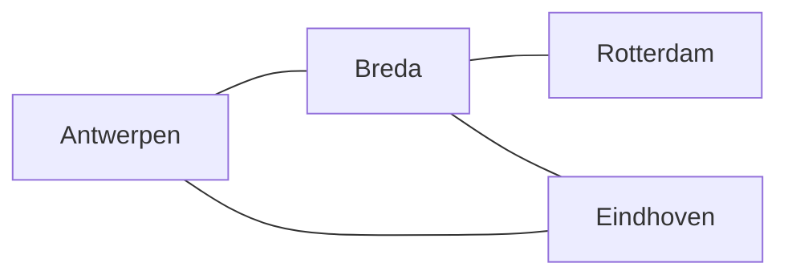

- Antwerpen heeft drie verbindingen in deze regio
- Rotterdam is alleen bereikbaar via Breda

---

## De state graph: Vlaanderen

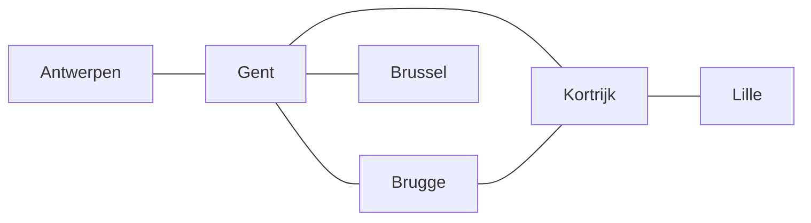

- Gent is het knooppunt van Vlaanderen
- Via Kortrijk rij je Frankrijk in, naar Lille

---

## De state graph: Wallonië en Luxemburg

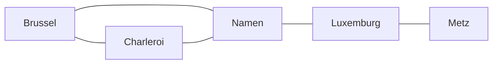

- Brussel verbindt Vlaanderen met Wallonië
- Via Namen kan je richting Luxemburg en Metz rijden

---

## De state graph: noord-Frankrijk

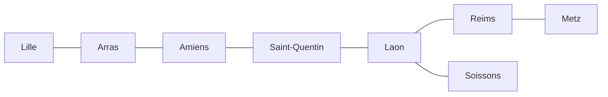

- Amiens is opnieuw een knooppunt
- Via Laon bereik je zowel Reims als Soissons

---

## De state graph: noordwest-Frankrijk

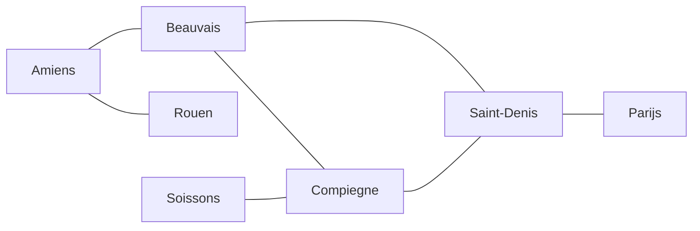

- Via Beauvais en Compiègne slinger je naar Parijs
- Rouen is een doodlopende tak

---

## De state graph: Parijs en omstreken

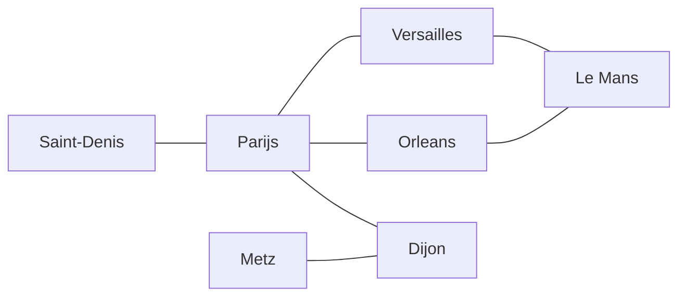

- Parijs is vanaf vier kanten bereikbaar
- Dijon en Metz verbinden de oostelijke route

---

## De volledige state graph: Antwerpen → Parijs

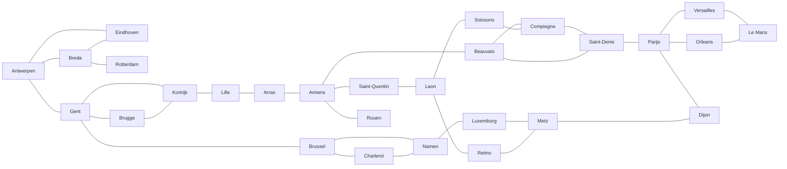

- Alle regio's samen: Nederland, Vlaanderen, Wallonië, Frankrijk
- Dit is de state space waarop BFS en DFS zoeken

## Kostfunctie

Er zijn verschillende goede kostfuncties:

- Reistijd
- Afstand
- Verwacht energieverbruik
- CO2-uitstoot
- Combinatie van bovenstaande

---

<!-- _class: red-bg -->

# Ongeïnformeerd zoeken

---

## Soorten zoekstrategieën

| Type | Kenmerk |
|---|---|
| Ongeïnformeerd | Kent enkel de graaf, algemeen werkend |
| Geïnformeerd | Kent heuristieken, sneller maar specifieker |

- Ongeïnformeerd: de algoritmes zijn heel algemeen werkend
- Geïnformeerd: het algoritme kent "truukjes" om slimmer te zoeken

---

## Search tree en frontier

- Ongeïnformeerde zoekalgoritmes bouwen een **search tree** op basis van de state graph
- Een node in de search tree is een state in de state graph
- De subnodes van een node zijn rechtstreeks verbonden in de state graph
- De vraag is: welke node klappen we eerst open?

- **Breadth-first**: eerst alle directe buren, dan hun buren
- **Depth-first**: eerst de diepste node uit de frontier

---

<!-- _class: red-bg -->

# Breadth-first search

---

## BFS: hoe werkt het?

- BFS klapt de frontier **niveau per niveau** open
- Frontier: de nodes die bereikt zijn maar nog niet opengeklapt
- Bereikt: alle steden waarvan we de kost kennen
- We bekijken het stappenplan op de graaf van Antwerpen naar Parijs

---

## BFS stap 1: Antwerpen openklappen

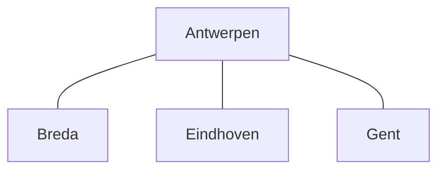

- Frontier: Breda, Eindhoven, Gent
- Bereikt: Antwerpen, Breda, Eindhoven, Gent

---

## BFS stap 2: niveau 2

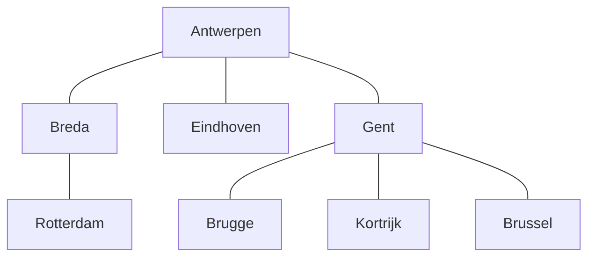

- Frontier: Rotterdam, Eindhoven, Gent, Brugge, Kortrijk, Brussel
- Eindhoven en Gent zijn al bereikt via Antwerpen, geen nieuwe paden

---

## BFS stap 3: richting Frankrijk

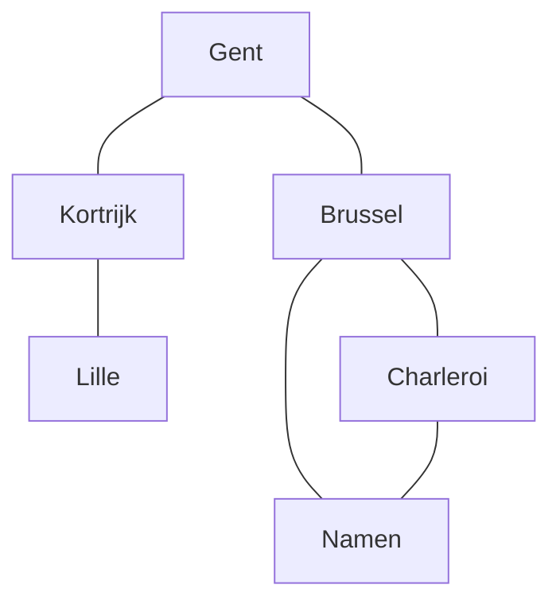

- Frontier: Lille, Charleroi, Namen
- Charleroi en Namen zijn onderling verbonden, dubbel bereikt

---

## BFS stap 4: door het binnenland

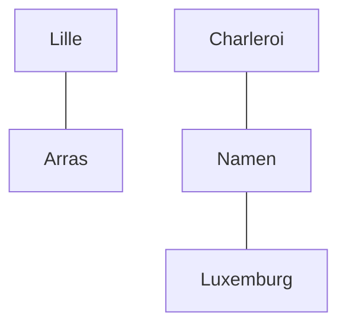

- Frontier: Arras, Luxemburg
---

## BFS stap 5 en 6: het laatste stuk

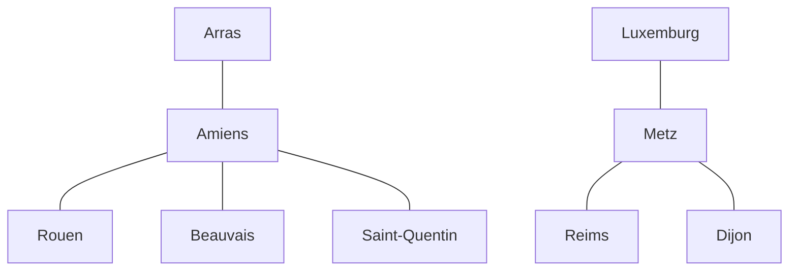

- Frontier: Rouen, Beauvais, Saint-Quentin, Reims, Dijon

---

## BFS stap 7: Parijs gevonden

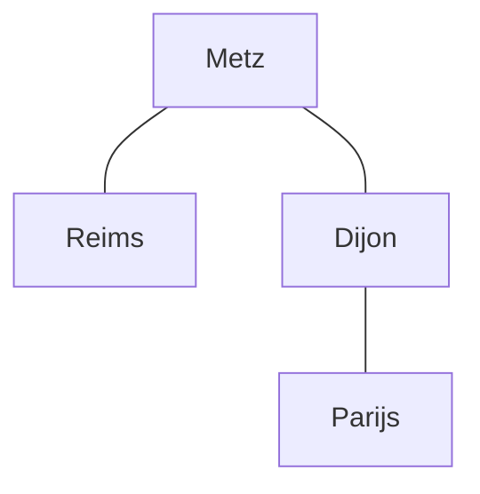

- **Parijs is bereikt!**
- Gevonden pad: Antwerpen → Gent → Brussel → Namen → Luxemburg → Metz → Dijon → Parijs
- BFS vindt de route met het **minste aantal steden**
- Dat is niet per se de kortste route in km

---

## BFS: eigenschappen

- Relevant wanneer alle child nodes dezelfde kost hebben
- Systematisch: elke steen wordt omgedraaid, niks wordt vergeten
- Vindt de oplossing in het minste aantal stappen, als de kost overal gelijk is
- Complexiteit:
  - b: branching number, het aantal opties per node
  - d: diepte van de graaf, hier het aantal steden tussen Antwerpen en Parijs
  - $O(b^d)$: groeit heel hard!
- In de praktijk enkel bruikbaar voor kleine depths

---

<!-- _class: red-bg -->

# Depth-first search

---

## DFS: hoe werkt het?

- In plaats van niveau per niveau, zoek je eerst **in de diepte**
- Je neemt de diepste node uit de frontier en klapt die open
- Dit leidt sneller tot een uitkomst, maar je riskeert de allerbeste oplossing te missen
- Het heeft veel minder geheugen nodig dan BFS
- Het is de standaardkeuze in heel veel gevallen
- Tenzij je meer info hebt en nog slimmer de eerste node kan kiezen

---

## BFS vs DFS

| Eigenschap | BFS | DFS |
|---|---|---|
| Volgorde | niveau per niveau | diepte eerst |
| Volledig? | ja, systematisch | ja, maar niet optimaal |
| Optimale oplossing? | ja, bij gelijke kost | nee |
| Geheugen | veel | weinig |
| Complexiteit | $O(b^d)$ | afhankelijk van pad |
---

## [DEMO] Implementatie

```python
from collections import deque

def breadth_first_search(initial_node, goal_state):
    frontier = deque([initial_node])
    explored = set()
    while frontier:
        node = frontier.popleft()
        if node.state.name == goal_state.name:
            return node
        explored.add(node.state)
        for action in node.actions:
            if action.state not in explored:
                frontier.append(action)
    return None
```

---

## [DEMO] Implementatie

```python
def depth_first_search(initial_node, goal_state):
    explored = set()
    return dfs_recursive(initial_node, goal_state, explored)

def dfs_recursive(node, goal_state, explored):
    if node.state.name == goal_state.name:
        return node
    explored.add(node.state)
    for action in node.actions:
        if action.state not in explored:
            result = dfs_recursive(action, goal_state, explored)
            if result:
                return result
    return None
```

- [LIVE DEMO]: zoek op de stedengraaf met beide algoritmes en vergelijk

---

<!-- _class: red-bg -->

# Geïnformeerd zoeken

---

## Best-first search

- Wat is voor ons probleem een goede keuze voor "best"?
- Een **heuristiek** bepaalt welke node het meest veelbelovend is
- In vogelvlucht dichter bij Parijs is een kandidaat-functie
- Voorwaarde: de coördinaten van de steden zijn gekend

---

## Toepassing: schuifpuzzel

- We lossen een schuifpuzzel op met een zoekalgoritme
- De state space bevat configuraties van de puzzel
- Startpositie → einddoel, de opgeloste puzzel
- De tekening is de search tree van de state space van de schuifpuzzel
- [DEMO]: denk na over hoe je de puzzel implementeert

---

## Search tree (gebaseerd op state space van een schuifpuzzel)

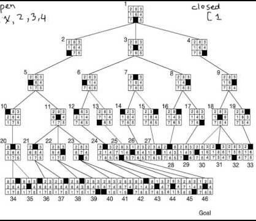


---

## Samenvatting

- Een zoekprobleem: state space, initial, goal, acties, transitiemodel, kostfunctie
- Onze stedengraaf: van Antwerpen tot Parijs, regio per regio
- BFS: systematisch, vindt het pad met het minste stappen, maar $O(b^d)$
- DFS: sneller en zuiniger in geheugen, maar riskeert de optimale oplossing
- Geïnformeerd zoeken: met een heuristiek kan het slimmer

---

<!-- _class: red-bg -->

# Vragen?